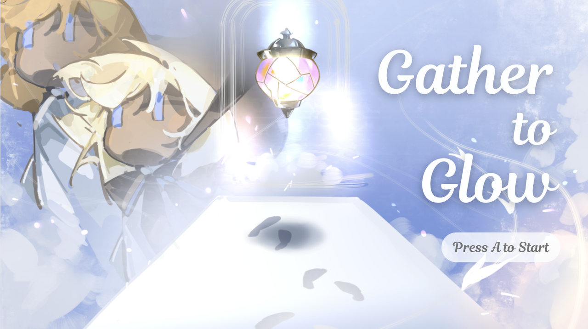
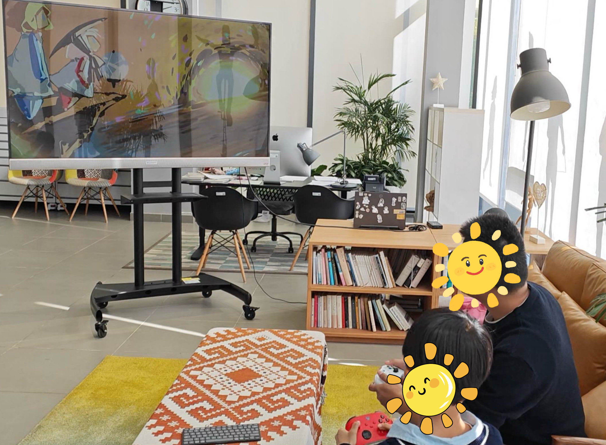
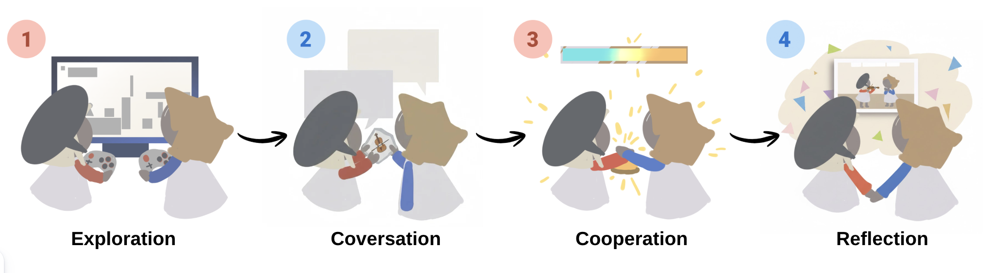
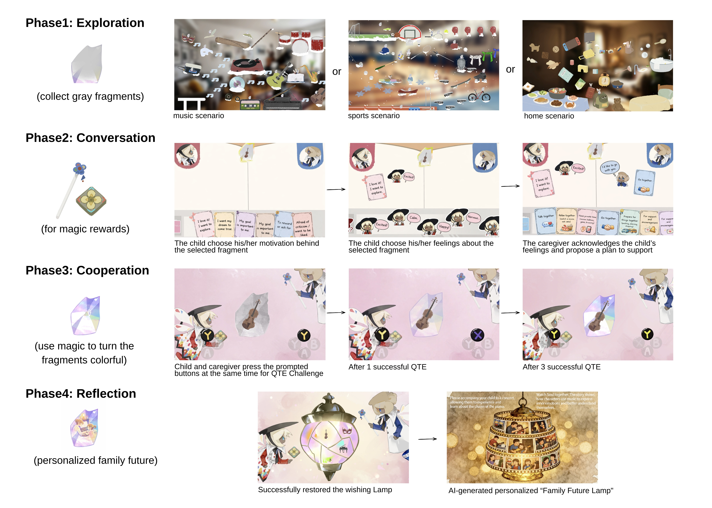
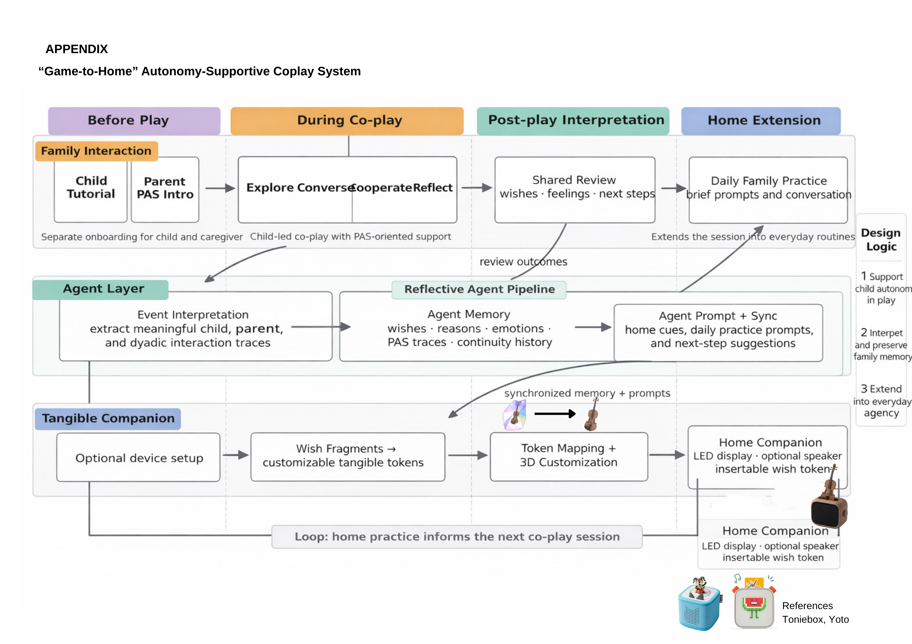

# Gather to Glow: An Autonomy-Supportive Game for Parent–Child Coplay

## Game Intro

Gather-to-Glow is an HCI research project that presents a parent–child digital co-play system designed to support children’s autonomy and encourage more supportive rather than controlling caregiver participation. It is grounded in the psychological frameworks of Self-Determination Theory (SDT) and Parental Autonomy Support (PAS), as well as HCI design approaches to autonomy-supportive game affordances.

Findings from a pilot study with four families suggest that Gather-to-Glow has the potential to support children’s autonomy—defined as making choices aligned with their own interests and intentions—while encouraging autonomy-supportive parenting and child agency, as children initiated shared activity and connected in-game choices to real-life goals.

<table>
  <tr>
    <td width="58%">
      
    </td>
    <td width="42%">
      
    </td>
  </tr>
</table>

This is a two-controller parent–child co-play game designed for shared play on a computer or family TV.

- **Pictorial of our work:** [View pictorial](https://drive.google.com/file/d/1YQ-MM9sPiKmQlAIyKvt32g6DnYVbCAI3/view?usp=sharing)
- **Game Demo Video Preview:** [Watch on YouTube](https://www.youtube.com/watch?v=J9GeQhT2NtI)
- **Game Download for Windows:** [Download Windows build](https://github.com/karina-wang/Gather-to-Glow-Demo/releases/latest/download/Gather-to-Glow-Windows.zip)
- **Game Download for macOS (Apple Silicon):** [Download macOS build](https://github.com/karina-wang/Gather-to-Glow-Demo/releases/latest/download/Gather-to-Glow-mac-AppleSilicon.zip)

## Motivation

Parent–child digital co-play can be a valuable form of family interaction, but caregiver involvement is not always supportive. In some cases, adults may unintentionally take over the interaction, reducing children’s opportunities to lead, choose, and act with a sense of ownership.

Gather-to-Glow explores how a co-play game can be designed to preserve children’s autonomy while encouraging caregiver participation aligned with parental autonomy support.

## Game Narrative

Gather to Glow is set in the world of the Crayon Spirits, where a child and caregiver take on the roles of the Crayon Angel (children’s character) and Guardian Angel (caregiver’s character). At first, the Wish Lamp shines with children’s wishes and shared family hopes. But one day, the lamp shatters, and its light breaks into scattered grey fragments. Co-play then becomes a collaborative journey of restoration.

## Role Design and Controls

Gather-to-Glow uses an **asymmetric role design** to preserve child-led play while encouraging supportive caregiver participation.

- **Child:** explores the environment and uses **X** to collect wish fragments, keeping key progress actions child-led.
- **Caregiver:** provides scaffolding support rather than direct control, including pressing **A** twice to activate a double-jump assist that helps the child reach higher platforms.
- **Collaborative mechanic:** when both players press **Y** together, the caregiver can pull the child upward through a hand-holding action.

### Children’s Controls
- **X** — collect wish fragments
- **Left Stick** — move
- **A** — jump
- **Press A twice** — caregiver double-jump assist
- **Y** — collaborative hand-pull

### Caregiver’s Controls
- **Left Stick** — move
- **A** — jump
- **Press A twice** — caregiver double-jump assist
- **Y** — collaborative hand-pull

## Gameplay Loop

The demo centers on a four-phase gameplay loop for parent–child co-play.

The game structures child-led action and caregiver support through a four-phase loop of **exploration, conversation, cooperation, and reflection**.

### 1. Exploration

The child freely explores selectable scenarios to find grey wish fragments of interest, while the caregiver supports navigation without directing goals. Interactive platforms are designed to make exploration playful and engaging, such as instrument-triggered sound cues in the Music scene and trampoline-like movement in the Sports scene. The child can move on after collecting just one fragment, keeping progression low-pressure and child-led.

### 2. Conversation

The dyad then enters a Magic Book dialogue space structured to support meaningful parent–child conversation. The child chooses one collected fragment to discuss, explains why it matters, and selects an emoji to express the related feeling. The caregiver responds with supportive prompts that acknowledge the child’s perspective and offer involvement rather than control.

### 3. Cooperation

Next, the child and caregiver complete a short synchronized challenge together. By responding to on-screen prompts at the same time, they gradually restore the selected fragment from grey to color, creating a clear moment of shared coordination and accomplishment.

### 4. Reflection

Finally, the game connects play to everyday family life. An AI-generated Family Lamp transforms the child’s collected fragments into a future-oriented family artifact and suggests optional follow-up activities based on the child’s interests.

## Future Work: From In-Game Autonomy to Everyday Agency

Building on our pilot findings, we are extending Gather-to-Glow into a game-to-home autonomy-supportive co-play system. While the current game shows potential to preserve children’s in-game autonomy and create moments of child agency, our pilot also suggests that autonomy-supportive co-play may not naturally extend into everyday family routines.

Our future work explores how children’s in-game autonomy can be translated into everyday agency—children’s ability to initiate and act on their interests beyond the game session.

The proposed system combines three components:

- **Reflective Agent**  
  Captures children’s selected wishes, reasons, emotions, and child-led actions, then transforms them into shared family memories and PAS-aligned reflection prompts.

- **Caregiver Support**  
  Provides the emotional and practical support needed to acknowledge children’s perspectives, negotiate next steps, and participate in child-initiated activities without taking over.

- **Tangible Home Companion**  
  Keeps children’s selected wishes visible in the home environment through a shared smart device, supporting gentle reminders, reflection, and continuity in daily routines.

Together, these components form a collaborative support structure: the agent supports **memory and reflection**, caregivers support **real-world realization**, and the smart device supports **visibility and continuity**. In this way, Gather-to-Glow moves from supporting children’s autonomy during play toward sustaining children’s agency beyond play.

## Build Notes

- **Windows:** unzip the folder and run `Mixed.exe`
- **macOS (Apple Silicon):** unzip the file and open the `.app`
- Shared play on a computer or family TV
- Two controllers recommended; keyboards can also be used as an alternative

## Contact

jianingwang1@link.cuhk.edu.cn
